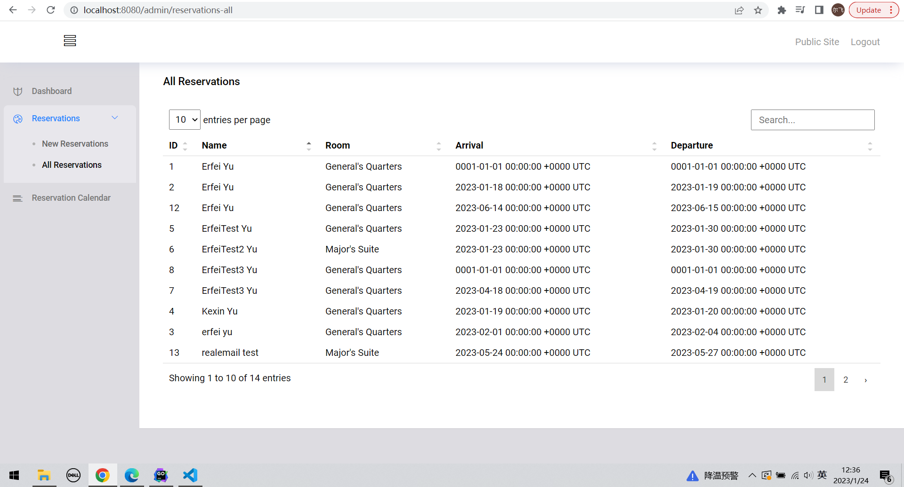
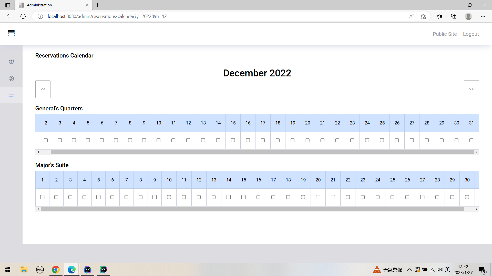

# Bookings and Reservation

This is the repository for my booking and reservation project

- Built in Go version 1.19
- Uses **Postgres**
- Uses the [chi router](https://github.com/go-chi/chi)
- Uses [alex edwards SCS session management](https://github.com/alexedwards/scs)
- Uses [Nosurf](https://github.com/justinas/nosurf)
- Uses Email validator - [Govalidator](https://github.com/asaskevich/govalidator)
- Uses [Go-Buffalo Soda](https://github.com/gobuffalo/buffalo) Database migrator
- Uses [MailHog](https://github.com/mailhog/MailHog) for email-sending test
- Uses Go email sender [Go-Simple-Mail](https://github.com/xhit/go-simple-mail)

## Test for reservation list
Get all reservations stored in database and list them on the admin page.

## Reservation Calendar
- Display the number of days according to the actual month

Bootsrtap 版本冲突问题太难解决啦！！！！心态崩了

## Very Very Very Silly Deployment
depoyed in Aliyun http://47.115.230.21:8080/